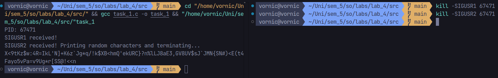
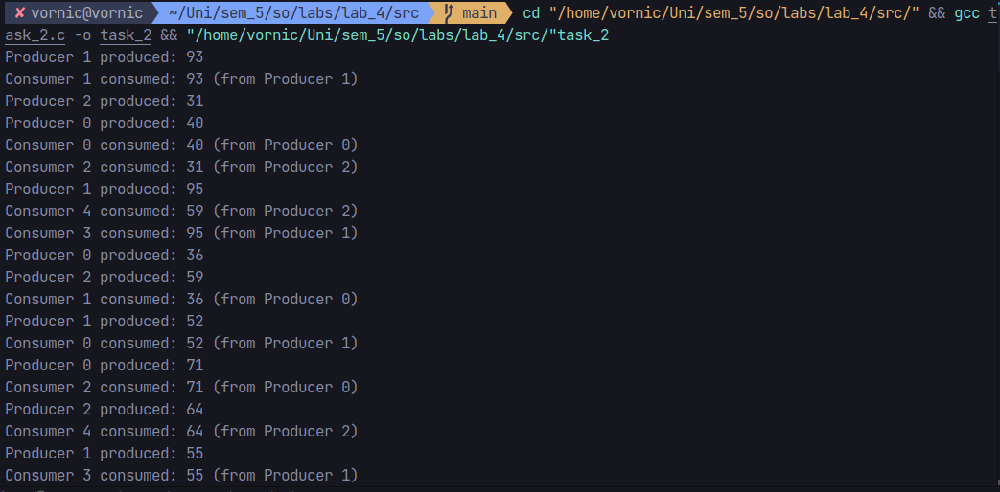
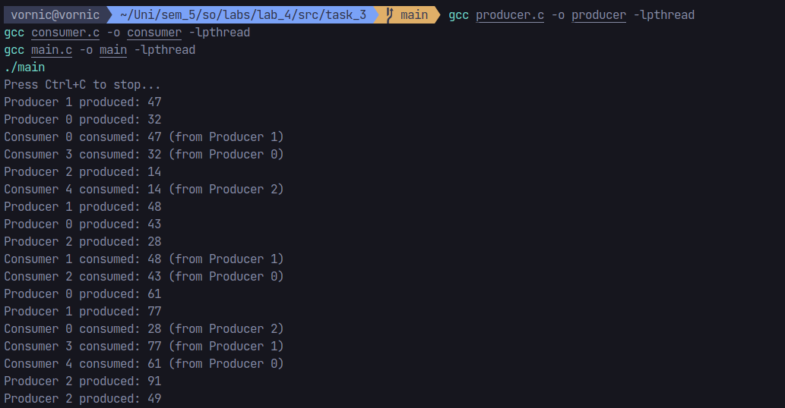

# Laboratory work #4 - Processes. Threads. Signals. IPC

## Author: Daniela Vornic, FAF-222

## Objectives:

- **Task 1.** Write a program that would perform different actions when receiving `SIGUSR1` and `SIGUSR2`.
  - When receiving `SIGUSR1`, the program should display that `SIGUSR1` was received.
  - When receiving `SIGUSR2`, the program should write 100 random ASCII characters to the output and terminate itself.
- **Task 2 and 3.** Provide implementations for the producer-consumer problem (process-based implementation / thread-based implementation)
  - A producer will be a process/thread that can produce up to 3 items at the same time. The item will be a random number. In order to not overproduce, please use semaphores to control the producing process.
    When producing the item, the producer will also display a message on the console that will display a producer id (0, 1, 2) and the produced value.
  - A consumer will be a process/thread that can consume up to 5 items at the same time. The item will be the random number received from the producer. When consuming a message from the producer, the consumer will display a consumer id and the consumed value.
  - For inter process communication, you can use pipes (unnamed pipes for thread-based communication, named pipes for process-based communication)

## Introduction

Operating Systems rely on process management, inter-process communication (IPC), and synchronization mechanisms. This laboratory work explores these concepts through practical implementations, focusing on signal handling, thread management, and the producer-consumer problem.

Signal handling in Unix-like systems offers a fundamental mechanism for process communication and control. Signals, such as `SIGUSR1` and `SIGUSR2`, allow processes to respond to external events asynchronously, making them crucial for process management.

The producer-consumer problem, first introduced by Dijkstra, represents a classic synchronization challenge in computer science. It depicts common scenarios in operating systems where multiple processes or threads must coordinate their actions with limited resources.

## Implementation details

### Task 1

For the first task, I implemented a signal handling program that responds to SIGUSR1 and SIGUSR2 signals in distinct ways. These are the key components:

```c
void sigusr1_handler(int signum) {
    printf("SIGUSR1 received!\n");
}

void sigusr2_handler(int signum) {
    printf("SIGUSR2 received! Printing random characters and terminating...\n");
    srand(time(NULL));
    for (int i = 0; i < 100; i++) {
        printf("%c", (rand() % (126-33+1)) + 33);
    }
    printf("\n");
    exit(0);
}
```

The program utilizes two signal handlers to process the incoming `SIGUSR1` and `SIGUSR2` signals. The first handler simply acknowledges the `SIGUSR1` with a message, while the second handler generates 100 random ASCII characters before terminating the program.
For character generation, I chose to work with printable ASCII characters (ranging from 33 to 126) to ensure readable output. The main program runs in an infinite loop, waiting for signals:

```c
int main() {
    signal(SIGUSR1, sigusr1_handler);
    signal(SIGUSR2, sigusr2_handler);
    printf("PID: %d\n", getpid());

    while(1) {
        sleep(1);
    }
    return 0;
}
```

The `signal` function is imported from the `signal.h` library and is used to assign the signal handlers to the corresponding signals. The program then enters an infinite loop, waiting for signals to be received. The program's PID is also displayed to the console.

### Task 2

For the second task, I implemented the classic producer-consumer problem using a thread-based approach. In this implementation, producer threads generate random numbers that consumer threads must process.

Without synchronization, producers might overwhelm the system with data, or consumers might attempt to read data that hasn't been created yet. To address this, this implementation uses two synchronization mechanisms: semaphores and pipes.

Starting off with the libraries, we need to include the following:

```c
#include <stdio.h>
#include <stdlib.h>
#include <pthread.h>
#include <semaphore.h>
#include <unistd.h>
#include <time.h>
#include <signal.h>
```

The hightlight of the library list is the `pthread.h` library, which provides the necessary functions for creating and managing threads.

Among the global variables, we have these:

```c
#define NUM_PRODUCERS 3
#define NUM_CONSUMERS 5

typedef struct {
    int producer_id;
    int value;
} Message;

int pipe_fd[2];
sem_t producer_sem;
volatile sig_atomic_t running = 1;
```

The `NUM_PRODUCERS` and `NUM_CONSUMERS` constants define the number of producer and consumer threads. The `Message` structure is the data transfer unit; it contains both the producer's identifier and the generated value. The pipe file descriptors (`pipe_fd`) create our communication channel, with index 0 for reading and index 1 for writing. The semaphore (`producer_sem`) acts as the production controller, such that we never exceed our limit of three simultaneous productions. The volatile `sig_atomic_t` ensures thread-safe program termination when receiving signals for shutting down.

The producer thread function handles the data generation:

```c
void* producer(void* arg) {
    int id = *(int*)arg;
    srand(time(NULL) + id);

    while(running) {
        sem_wait(&producer_sem);

        Message msg;
        msg.producer_id = id;
        msg.value = rand() % 100;

        if(write(pipe_fd[1], &msg, sizeof(Message)) == sizeof(Message)) {
            printf("Producer %d produced: %d\n", id, msg.value);
            fflush(stdout);
        }

        sem_post(&producer_sem);
        usleep(100000);
    }
    return NULL;
}
```

Each producer thread begins by declaring its identifier (`id`), and then seeds its random number generator uniquely (`srand(time(NULL) + id)`). The thread then enters an infinite loop, and using `sem_wait`, it waits for the semaphore to be available. Once the semaphore is available, the producer creates a `Message` structure containing the producer's identifier and a random value. The message is then written to the pipe (`write(pipe_fd[1], &msg, sizeof(Message)) == sizeof(Message)`), and the producer releases the semaphore with `sem_post`. The thread then sleeps for 100 milliseconds before repeating the process, to avoid overwhelming the system with data. It returns `NULL` when the program is terminated.

The `fflush(stdout)` function is used to ensure that the output is displayed immediately, rather than being buffered. This is particularly important when working with multiple threads, as it ensures that the output is displayed in the correct order.

The consumer thread function handles data consumption, in a similar manner to the producer:

```c
void* consumer(void* arg) {
    int id = *(int*)arg;
    srand(time(NULL) + id + 100);
    Message msg;

    while(running) {
        if(read(pipe_fd[0], &msg, sizeof(Message)) == sizeof(Message)) {
            printf("Consumer %d consumed: %d (from Producer %d)\n",
                   id, msg.value, msg.producer_id);
            fflush(stdout);
            usleep(200000);
        }
    }
    return NULL;
}
```

Consumers operate more simply than producers, because they don't require semaphore control. Instead, they read data from the pipe (`read(pipe_fd[0], &msg, sizeof(Message)) == sizeof(Message)`), process the data, and display the consumer's identifier, the consumed value, and the producer's identifier. The consumer thread also sleeps for 200 milliseconds to simulate processing time.

Also, a note for these 2 functions: The usage of `void*` as the return type for the thread functions is necessary due to the POSIX thread API. The `void*` return type allows the functions to return a pointer to any type of data, which can then be cast to the appropriate type when the function is called.

Finally, the main function creates the producer and consumer threads, initializes the semaphore, and manages the program's termination:

```c
int main() {
    signal(SIGINT, handle_signal);
    signal(SIGTERM, handle_signal);

    if(pipe(pipe_fd) == -1) {
        perror("pipe");
        return 1;
    }

    sem_init(&producer_sem, 0, 3);

    pthread_t producers[NUM_PRODUCERS];
    pthread_t consumers[NUM_CONSUMERS];
    int producer_ids[NUM_PRODUCERS];
    int consumer_ids[NUM_CONSUMERS];
```

The main function begins by setting up signal handlers. It then creates the unnamed pipe for inter-thread communication and initializes the semaphore with a value of 3, allowing up to three simultaneous productions. The producer and consumer arrays are prepared, and then created:

```c
for(int i = 0; i < NUM_PRODUCERS; i++) {
    producer_ids[i] = i;
    pthread_create(&producers[i], NULL, producer, &producer_ids[i]);
}

for(int i = 0; i < NUM_CONSUMERS; i++) {
    consumer_ids[i] = i;
    pthread_create(&consumers[i], NULL, consumer, &consumer_ids[i]);
}
```

The program creates three producer threads and five consumer threads, each with a unique identifier. This identifier enables tracking of which producer generated each value and which consumer processed it.

Lastly, I also added cleanup code such that the program can be terminated gracefully:

```c
while(running) {
    sleep(1);
}

for(int i = 0; i < NUM_PRODUCERS; i++) {
    pthread_cancel(producers[i]);
    pthread_join(producers[i], NULL);
}
for(int i = 0; i < NUM_CONSUMERS; i++) {
    pthread_cancel(consumers[i]);
    pthread_join(consumers[i], NULL);
}

sem_destroy(&producer_sem);
close(pipe_fd[0]);
close(pipe_fd[1]);
```

When the program receives a termination signal, it cancels all threads, waits for their completion, and cleans up the synchronization primitives. This cleanup prevents resource leaks.

### Task 3

For the third task, I reimplemented the producer-consumer problem using a process-based approach. This implementation demonstrates IPC using named pipes (FIFOs).

The solution is structured into three main components:

1. Main process (`main.c`)

```c
#define FIFO_PATH "/tmp/prodcon_fifo"
#define SEM_PRODUCER_NAME "/producer_sem"
#define NUM_PRODUCERS 3
#define NUM_CONSUMERS 5
```

The main process is responsible for creating and managing the FIFO, initializing the system-wide semaphore, monitoring producer and consumer processes, and handling cleanup on program termination.

This is the initialization section:

```c
if(mkfifo(FIFO_PATH, 0666) == -1) {
    perror("mkfifo");
    return 1;
}

sem_t *producer_sem = sem_open(SEM_PRODUCER_NAME, O_CREAT, 0666, 3);
```

The FIFO is created with read/write permissions for all users (0666). The semaphore is initialized to allow three concurrent producers, similar to our thread-based implementation. However, this semaphore is system-wide, accessible to all processes.

The process creation section is as follows:

```c
for(int i = 0; i < NUM_CONSUMERS; i++) {
    pid_t pid = fork();
    if(pid == 0) {
        char id[2];
        sprintf(id, "%d", i);
        execl("./consumer", "consumer", id, NULL);
        exit(1);
    }
    consumer_pids[i] = pid;
}
```

I created the consumer processes first (to ensure they're ready to receive data) in a loop, using the `fork` system call. The child process then replaces itself with the consumer executable using `execl`. The consumer process identifier is passed as an argument to the consumer executable.

The creation of producer processes is similar:

```c
for (int i = 0; i < NUM_PRODUCERS; i++) {
    pid_t pid = fork();
    if (pid == 0) {
        char id[2];
        sprintf(id, "%d", i);
        execl("./producer", "producer", id, NULL);
        exit(1);
    }
    producer_pids[i] = pid;
}
```

Similarly to task 2, the main process waits for termination signals and cleans up resources.

```c
for (int i = 0; i < NUM_PRODUCERS; i++) {
    waitpid(producer_pids[i], NULL, 0);
}
for (int i = 0; i < NUM_CONSUMERS; i++) {
    waitpid(consumer_pids[i], NULL, 0);
}

cleanup();
```

```c
void cleanup()
{
    sem_unlink(SEM_PRODUCER_NAME);
    unlink(FIFO_PATH);
}
```

```c
void handle_signal(int sig) {
    running = 0;
    for(int i = 0; i < NUM_PRODUCERS; i++) {
        if(producer_pids[i] > 0) kill(producer_pids[i], SIGTERM);
    }
    for(int i = 0; i < NUM_CONSUMERS; i++) {
        if(consumer_pids[i] > 0) kill(consumer_pids[i], SIGTERM);
    }
}
```

It uses the `waitpid` function to wait for the termination of all producer and consumer processes. The `cleanup` function is called to remove the semaphore and FIFO. The `handle_signal` function is used to handle termination signals, setting the `running` flag to 0 and sending termination signals to all producer and consumer processes.

2. Producer process (`producer.c`)

The producer process implements the data generation side, and it also uses the `Message` structure for data transfer:

```c
int fd = open(FIFO_PATH, O_WRONLY);
sem_t *producer_sem = sem_open(SEM_PRODUCER_NAME, 0);

while(running) {
    sem_wait(producer_sem);
    Message msg;
    msg.prod_id = prod_id;
    msg.value = rand() % 100;

    if(write(fd, &msg, sizeof(Message)) == sizeof(Message)) {
        printf("Producer %d produced: %d\n", prod_id, msg.value);
        fflush(stdout);
    }
    sem_post(producer_sem);
    usleep(100000);
}
```

Each producer:

- Opens the named pipe in write-only mode;
- Accesses the existing semaphore (see the different `sem_open` flags);
- Generates and writes messages under semaphore control;
- Includes its process ID in each message for tracking.

3. Consumer process (`consumer.c`)

The consumer process handles consumption:

```c
int fd = open(FIFO_PATH, O_RDONLY);
Message msg;

while(running) {
    if(read(fd, &msg, sizeof(Message)) == sizeof(Message)) {
        printf("Consumer %d consumed: %d (from Producer %d)\n",
               consumer_id, msg.value, msg.prod_id);
        fflush(stdout);
        usleep(200000);
    }
}
```

Consumers are simpler than producers as they:

- Open the FIFO in read-only mode;
- Read messages continuously;
- Don't require semaphore access.

## Screenshots & Results

In Figure 1, the console output for Task 1 is displayed. The program is running and waiting for signals to be received. The PID is also shown. In another terminal, the program was terminated with the command `kill -SIGUSR1 <PID>`. The program responded with the message "SIGUSR1 received!". When entering the command `kill -SIGUSR2 <PID>`, the program generated 100 random ASCII characters and terminated.


_Figure 1: Console output for Task 1_

Figure 2 shows the producer-consumer program in action using threads. The program is running, and the producer threads are generating random numbers. The consumer threads are consuming the data, displaying the consumer ID, the consumed value, and the producer ID. The program is terminated with the `Ctrl+C` command.


_Figure 2: Console output for Task 2_

The order of the output may vary due to the nature of multithreading, but overall, the program functions as expected, with producers generating data and consumers processing it.

The output for task 3 (Figure 3) looks similar, since the producer-consumer problem is solved in the same way, but using processes instead of threads. For compilation, the program was compiled with `gcc main.c -o main -lpthread`, `gcc producer.c -o producer`, and `gcc consumer.c -o consumer`, and the `-lpthread` flag was used to link the pthread library.


_Figure 3: Console output for Task 3_

## Conclusion

Working on this laboratory project helped me gain practical experience with core operating system concepts. I found it particularly interesting to see how differently the same producer-consumer problem can be solved - first with threads sharing memory space, then with separate processes communicating through pipes.

The signal handling implementation showed me how elegant Unix signals can be for process communication, while building two producer-consumer versions helped me understand more about the real challenges of concurrent programming. I especially appreciated learning how to properly manage resources and handle synchronization.
