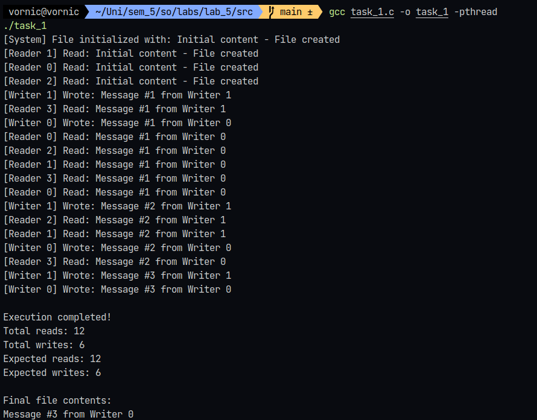
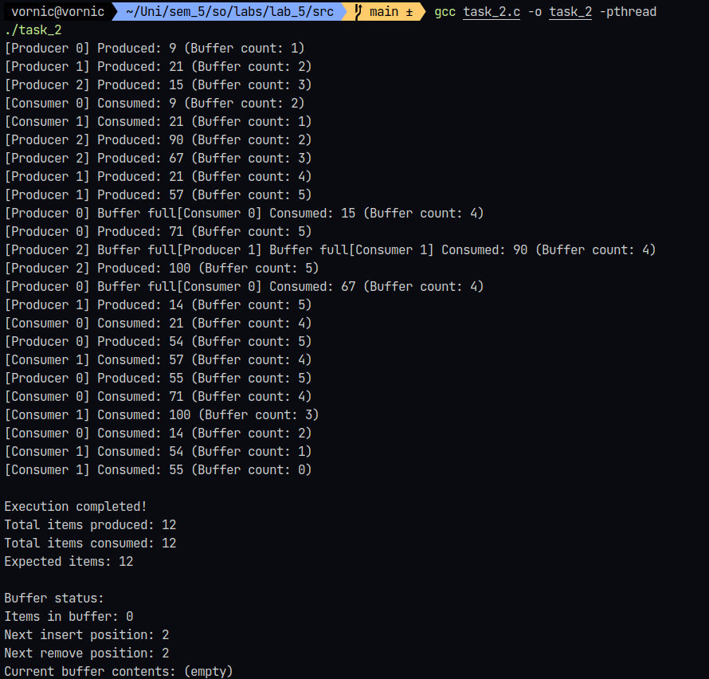

# Laboratory work #5 - Synchronization and Concurrency

## Author: Daniela Vornic, FAF-222

## Objectives

- **Task 1:** Implement a solution to the classic Reader-Writer problem using pthreads and POSIX semaphores in Linux.

  - Create a shared resource (file) that multiple reader and writer threads will access;
  - Multiple readers can read simultaneously;
  - Writers have exclusive access; no other reader or writer can access the resource while a writer is writing;
  - Use semaphores to manage synchronization between the reader and writer threads;
  - Test the program by creating multiple threads (e.g., 5 readers and 2 writers) and ensure no race conditions occur;
  - The number of readers and writers should be configurable via variables.

- **Task 2:** Solve the Producer-Consumer problem using pthreads and a bounded buffer to explore synchronization with mutexes and condition variables.
  - Use a fixed-size array as the bounded buffer;
  - Make buffer size configurable via preprocessor macro;
  - Use producer threads to insert items and consumer threads to remove items;
  - Implement proper synchronization using mutexes and condition variables to ensure:
    - Producers block if the buffer is full;
    - Consumers block if the buffer is empty;
  - Verify the solution by running multiple producer and consumer threads, with each printing the items they produce or consume.

## Introduction

This laboratory work includes fundamental synchronization problems in operating systems: the Reader-Writer problem and the Producer-Consumer problem. These problems are common in concurrent programming and require synchronization.

The Reader-Writer problem demonstrates a situation where multiple threads need to access a shared resource, but with different priorities and access patterns. The Producer-Consumer problem with a bounded buffer represents another synchronization challenge, where producers generate data that consumers must process, with a fixed-size buffer between them.

## Implementation details

### Task 1: Reader-Writer Problem

For the first task, I implemented a solution to the Reader-Writer problem that uses a combination of semaphores and mutexes to control access to a shared file. Here are the key components:

First, the necessary configuration and synchronization variables:

```c
#define SHARED_FILE "shared_data.txt"
#define MAX_BUFFER 256

// configuration variables
#define NUM_READERS 4
#define NUM_WRITERS 2
#define NUM_ITERATIONS 3

// synchronization variables
sem_t resource_access;
sem_t reader_count_mutex;
int reader_count = 0;
```

The configuration defines how many reader and writer threads we'll create and how many iterations each will perform. The synchronization variables include a semaphore controlling access to the shared file, a semaphore protecting the reader count, and the reader count itself.

The file operations are handled by two main functions:

```c
int write_to_file(const char* content)
{
    FILE* file = fopen(SHARED_FILE, "w");
    if (!file) {
        perror("Error opening file for writing");
        return -1;
    }
    fprintf(file, "%s", content);
    fclose(file);
    return 0;
}

int read_from_file(char* buffer, size_t size)
{
    FILE* file = fopen(SHARED_FILE, "r");
    if (!file) {
        perror("Error opening file for reading");
        return -1;
    }

    if (fgets(buffer, size, file) == NULL && ferror(file)) {
        perror("Error reading from file");
        fclose(file);
        return -1;
    }

    fclose(file);
    return 0;
}
```

These functions handle the actual file operations, with proper error checking. The write function uses "w" mode to overwrite the file's contents, while the read function uses "r" mode to read the file's contents into a buffer. Both functions return 0 on success and -1 on failure.

The writer thread function implements the writing mechanism:

```c
void* writer(void* arg)
{
    int id = *(int*)arg;
    char buffer[MAX_BUFFER];

    for (int i = 0; i < NUM_ITERATIONS; i++) {
        random_sleep();

        // wait for resource access
        sem_wait(&resource_access);

        // write to file
        snprintf(buffer, sizeof(buffer), "Message #%d from Writer %d", i + 1, id);

        if (write_to_file(buffer) == 0) {
            printf("[Writer %d] Wrote: %s\033[0m\n", id, buffer);
        } else {
            printf("[Writer %d] Failed to write\n", id);
        }

        pthread_mutex_lock(&stats_mutex);
        total_writes++;
        pthread_mutex_unlock(&stats_mutex);

        random_sleep();
        // release resource access
        sem_post(&resource_access);

        // longer sleep between writes
        usleep(rand() % 300000 + 200000);
    }
    return NULL;
}
```

The writer thread function implements a few key concepts. First, it requests exclusive access to the shared file using `sem_wait(&resource_access)`. This semaphore ensures that no other thread (reader or writer) can access the file while writing. The writer then performs the write operation, updates the statistics, and releases the semaphore with `sem_post(&resource_access)`. The random sleep functions simulate processing and writing times.

The reader thread function implements the reading mechanism with support for multiple simultaneous readers:

```c
void* reader(void* arg)
{
    int id = *(int*)arg;
    char buffer[MAX_BUFFER];

    for (int i = 0; i < NUM_ITERATIONS; i++) {
        random_sleep();

        sem_wait(&reader_count_mutex);
        reader_count++;
        if (reader_count == 1) {
            sem_wait(&resource_access);
        }
        sem_post(&reader_count_mutex);

        if (read_from_file(buffer, sizeof(buffer)) == 0) {
            printf("[Reader %d] Read: %s\033[0m\n", id, buffer);
        } else {
            printf("[Reader %d] Failed to read\n", id);
        }

        pthread_mutex_lock(&stats_mutex);
        total_reads++;
        pthread_mutex_unlock(&stats_mutex);

        sem_wait(&reader_count_mutex);
        reader_count--;
        if (reader_count == 0) {
            sem_post(&resource_access);
        }
        sem_post(&reader_count_mutex);

        // shorter sleep between reads
        usleep(rand() % 200000);
    }
    return NULL;
}
```

The reader thread function is more complex due to the reader count mechanism. It uses the `reader_count_mutex` semaphore to protect the reader count variable. When the first reader arrives, it locks the `resource_access` semaphore to prevent writers from accessing the file. When the last reader leaves, it releases the `resource_access` semaphore to allow writers to write. The random sleep simulates reading times, with shorter sleeps between reads.

The main function creates the reader and writer threads and waits for them to finish:

```c
int main()
{
    srand(time(NULL));

    if (sem_init(&resource_access, 0, 1) == -1 || sem_init(&reader_count_mutex, 0, 1) == -1) {
        perror("Semaphore initialization failed");
        return 1;
    }

    initialize_file();

    pthread_t readers[NUM_READERS];
    pthread_t writers[NUM_WRITERS];
    int reader_ids[NUM_READERS];
    int writer_ids[NUM_WRITERS];

    for (int i = 0; i < NUM_READERS; i++) {
        reader_ids[i] = i;
        if (pthread_create(&readers[i], NULL, reader, &reader_ids[i]) != 0) {
            perror("Failed to create reader thread");
            cleanup();
            return 1;
        }
    }

    usleep(100000);

    for (int i = 0; i < NUM_WRITERS; i++) {
        writer_ids[i] = i;
        if (pthread_create(&writers[i], NULL, writer, &writer_ids[i]) != 0) {
            perror("Failed to create writer thread");
            cleanup();
            return 1;
        }
    }

    // wait for all threads to finish
    for (int i = 0; i < NUM_READERS; i++) {
        pthread_join(readers[i], NULL);
    }
    for (int i = 0; i < NUM_WRITERS; i++) {
        pthread_join(writers[i], NULL);
    }

    cleanup();

    return 0;
}
```

The main function initializes the semaphores, creates the reader and writer threads, waits for them to finish, and displays the final statistics. The `cleanup` function releases the semaphores.

### Task 2: Producer-Consumer with Bounded Buffer

For the second task, I implemented the Producer-Consumer problem using a bounded buffer and condition variables. The implementation uses a circular buffer to efficiently manage the shared resource.

First, let's look at the core structures and configurations:

```c
#define BUFFER_SIZE 5
#define NUM_PRODUCERS 3
#define NUM_CONSUMERS 2
#define NUM_ITEMS_PER_PRODUCER 4
#define MAX_ITEM_VALUE 100

typedef struct {
    int items[BUFFER_SIZE];
    int in;      // index for next insert
    int out;     // index for next remove
    int count;
    pthread_mutex_t mutex;
    pthread_cond_t not_full;
    pthread_cond_t not_empty;
} BoundedBuffer;
```

The BoundedBuffer structure is the heart of this implementation, containing the buffer itself, indexes for insertion and removal, the current item count, and the synchronization variables. The buffer size, number of producers and consumers, and other configurations are defined as preprocessor macros.

The buffer initialization function sets up our synchronization primitives:

```c
void buffer_init(BoundedBuffer* buffer)
{
    buffer->in = 0;
    buffer->out = 0;
    buffer->count = 0;
    pthread_mutex_init(&buffer->mutex, NULL);
    pthread_cond_init(&buffer->not_full, NULL);
    pthread_cond_init(&buffer->not_empty, NULL);
}
```

The insertion and removal operations are important for the producer and consumer threads to interact with the buffer:

```c
void buffer_insert(BoundedBuffer* buffer, int item, int producer_id)
{
    pthread_mutex_lock(&buffer->mutex);

    // if buffer is full, wait
    while (buffer->count == BUFFER_SIZE) {
        printf("[Producer %d] Buffer full", producer_id);
        pthread_cond_wait(&buffer->not_full, &buffer->mutex);
    }

    buffer->items[buffer->in] = item;
    buffer->in = (buffer->in + 1) % BUFFER_SIZE;
    buffer->count++;

    printf("[Producer %d] Produced: %d (Buffer count: %d)\033[0m\n",
        producer_id, item, buffer->count);

    // signal that buffer is not empty
    pthread_cond_signal(&buffer->not_empty);
    pthread_mutex_unlock(&buffer->mutex);
}
```

The `buffer_insert` function locks the buffer mutex, checks if the buffer is full, and waits for the `not_full` condition variable. If the buffer is not full, it inserts the item, updates the buffer state, and signals that the buffer is not empty.

Similarly, the `buffer_remove` function removes an item from the buffer:

```c
int buffer_remove(BoundedBuffer* buffer, int consumer_id)
{
    pthread_mutex_lock(&buffer->mutex);

    // wait while buffer is empty
    while (buffer->count == 0) {
        printf("[Consumer %d] Buffer empty", consumer_id);
        pthread_cond_wait(&buffer->not_empty, &buffer->mutex);
    }

    int item = buffer->items[buffer->out];
    buffer->out = (buffer->out + 1) % BUFFER_SIZE;
    buffer->count--;

    printf("[Consumer %d] Consumed: %d (Buffer count: %d)\033[0m\n",
        consumer_id, item, buffer->count);

    // signal that buffer is not full
    pthread_cond_signal(&buffer->not_full);
    pthread_mutex_unlock(&buffer->mutex);

    return item;
}
```

The buffer mutex is locked, and the function waits for the `not_empty` condition variable if the buffer is empty. If the buffer is not empty, it removes an item, updates the buffer state, and signals that the buffer is not full.

The producer and consumer thread functions use these buffer operations to interact with the shared resource:

```c
void* producer(void* arg)
{
    int id = *(int*)arg;

    for (int i = 0; i < NUM_ITEMS_PER_PRODUCER; i++) {
        int item = rand() % MAX_ITEM_VALUE + 1;
        buffer_insert(&buffer, item, id);

        pthread_mutex_lock(&stats_mutex);
        total_items_produced++;
        pthread_mutex_unlock(&stats_mutex);

        usleep(rand() % 500000);
    }

    return NULL;
}

void* consumer(void* arg)
{
    int id = *(int*)arg;
    int items_to_consume = (NUM_PRODUCERS * NUM_ITEMS_PER_PRODUCER) / NUM_CONSUMERS;

    for (int i = 0; i < items_to_consume; i++) {
        int item = buffer_remove(&buffer, id);

        pthread_mutex_lock(&stats_mutex);
        total_items_consumed++;
        pthread_mutex_unlock(&stats_mutex);

        usleep(rand() % 800000);
    }

    return NULL;
}
```

The producer thread function generates random items and inserts them into the buffer. The consumer thread function removes items from the buffer and processes them. Both functions update the statistics and sleep for a random time to simulate processing.

A unique aspect of this implementation is how it balances the work between consumers. Each consumer is assigned a fair share of the total items to be produced, calculated as:

```c
items_to_consume = (NUM_PRODUCERS * NUM_ITEMS_PER_PRODUCER) / NUM_CONSUMERS;
```

This ensures that each consumer processes an equal number of items, regardless of the number of producers or items produced.

The main function initializes the buffer, creates the producer and consumer threads, waits for them to finish, and displays the final statistics, similar to the first task.

## Screenshots & Results

In Figure 1, we can see the output of the Reader-Writer implementation (Task 1). The execution demonstrates several key aspects of the solution:


_Figure 1: Console output for the Reader-Writer implementation_

It initially shows the file's initial content and multiple readers accessing this content simultaneously. Writers then update the file with their messages, and readers successfully see the updated content. The final statistics show the total reads and writes, which match the expected values.

Figure 2 shows the Producer-Consumer implementation with bounded buffer (Task 2):


_Figure 2: Console output for the Producer-Consumer implementation_

The output demonstrates several important behaviors. Producers generate random items and insert them into the buffer, while consumers remove and process these items. The buffer count accurately reflects the number of items in the buffer, and the final statistics show the total items produced and consumed, which match the expected values. The buffer is empty at the end, indicating that all items were successfully consumed.

## Conclusion

This laboratory work was a practical experience with synchronization and concurrency in operating systems. By implementing solutions to the Reader-Writer problem and the Producer-Consumer problem with a bounded buffer, I learned how to manage shared resources efficiently.

For example, the implementation of the Reader-Writer task demonstrated how to ensure that multiple readers can access the resource simultaneously, writers get exclusive access when needed, and data consistency is maintained throughout the process. Task 2 showed how to solve the Producer-Consumer problem using mutexes, and condition variables to synchronize producer and consumer threads.
