# Laboratory work #6 - Bash scripting

## Author: Daniela Vornic, FAF-222

## Introduction

Bash scripting is a fundamental skill for any Linux user or system administrator. Through shell scripts, complex operations can be simplified into automated sequences, making administration more efficient. This laboratory work shows various aspects of Bash scripting, from basic file operations to monitoring tasks.

## Exercises

### Exercise 1: File Permissions and Security Script

Write a Bash script that:

1. Checks if a file provided as a command-line argument has permissions more permissive than `rw-r--r--` (0644). If it does:

   - Display a warning message: `“The file has insecure permissions.”`
   - Correct the permissions to `rw-r--r--`.

2. Scans a directory provided as the second argument and identifies all files with the .sh extension. For each file found:

   - Check if the file has the executable bit set (`chmod +x`).
   - If the executable bit is missing, display a message: `“The script [file_name] is not executable.”`

Hint:

- Use the `ls -l` command to view file permissions.
- Compare permissions using `stat -c "%a"` and utilize if statements for conditions.
- Use the `find` command to scan directories.

#### Implementation

The script consists of two main functions and a control flow section.

The first one is `check_file_permissions` which checks if the file has permissions more permissive than rw-r--r-- (0644). If it does, it displays a warning message and corrects the permissions to `rw-r--r--`.

```bash
check_file_permissions() {
    local file=$1
    if [ ! -f "$file" ]; then
        echo "'$file' does not exist."
        exit 1
    fi

    current_perms=$(stat -c "%a" "$file")
    if [ "$current_perms" -gt 644 ]; then
        echo "The file $file has insecure permissions."
        chmod 644 "$file"
        echo "Permissions have been corrected to 644 (rw-r--r--)."
    fi
}
```

The next part of the task scans a directory for .sh files. It uses `find` with `-print0` to handle filenames with spaces properly. For each .sh file found, it checks if the executable bit is set using the `-x` test operator. The while loop with read safely processes the filenames from `find`.

```bash
check_sh_files() {
    local dir=$1
    if [ ! -d "$dir" ]; then
        echo "Directory '$dir' does not exist"
        exit 1
    fi

    while IFS= read -r -d '' script_file; do
        if [ ! -x "$script_file" ]; then
            echo "The script $script_file is not executable."
        fi
    done < <(find "$dir" -type f -name "*.sh" -print0)
}
```

The script needs 2 command-line arguments, enforced by checking `$#`. It then calls both functions with the provided arguments.

```bash
if [ $# -ne 2 ]; then
    echo "Usage: $0 <file_to_check> <directory_to_scan>"
    exit 1
fi

check_file_permissions "$1"
check_sh_files "$2"
```

#### Results

As shown in Figure 1, testing was performed using a directory 'dir_to_scan' containing two shell scripts with different executable permissions, and two test files (`insecure.txt` with 777 permissions and `secure.txt` with default permissions). The script execution successfully identified and corrected the permissions on `insecure.txt` from 777 to 644, and detected `script2.sh` as non-executable.

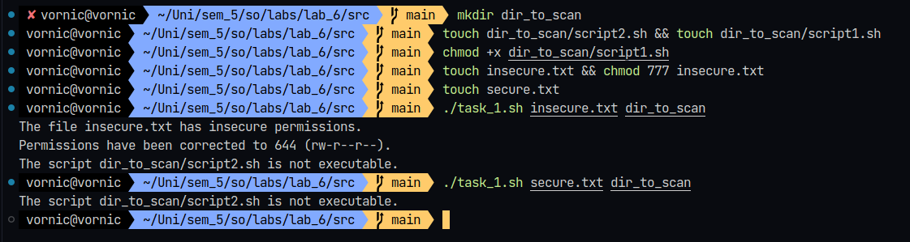
_Figure 1: Console output for Exercise 1_

### Exercise 2: File Integrity Checker

Write a Bash script that:

1. Takes two arguments:

   - The first argument is a file to check.
   - The second argument is a directory to scan.

2. Computes the MD5 hash of the file provided and stores it in a variable.

3. Scans the specified directory for files with the same name as the first argument and compares their hashes with the stored one.
   - If a match is found, display: “File integrity verified for [file_name].”
   - If no match is found, display: “File integrity compromised or file not found.”

Hint:

- Use the `md5sum` command to compute file hashes.
  The `find` command will help you locate files in the directory.

#### Implementation

Like in the first exercise, the script has two main functions and a control flow section.
The first function `get_file_hash` computes the MD5 hash of a given file using the `md5sum` command. It extracts only the hash value using cut to remove the filename from the output. Before computing the hash, it checks if the file exists using the `-f` test operator.

```bash
get_file_hash() {
    local file=$1
    if [ ! -f "$file" ]; then
        echo "Error: File '$file' does not exist."
        exit 1
    fi

    # only keep the hash part, not the filename
    md5sum "$file" | cut -d' ' -f1
}
```

The second function `check_file_integrity` scans the specified directory for files with the same name as the first argument and compares their hashes with the stored one. It uses `find` to locate files with the same name and `-exec` to compute their hashes. The `while` loop reads the output of `find` and `md5sum` and compares the hashes. If a match is found, it displays a message that the file integrity is verified.

```bash
check_file_integrity() {
    local original_file=$1
    local dir=$2
    local original_hash=$3
    local filename=$(basename "$original_file")
    local match_found=false

    if [ ! -d "$dir" ]; then
        echo "Error: Directory '$dir' does not exist."
        exit 1
    fi

    while IFS= read -r -d '' file; do
        current_hash=$(md5sum "$file" | cut -d' ' -f1)
        if [ "$current_hash" = "$original_hash" ]; then
            echo "File integrity verified for $file"
            match_found=true
        fi
    done < <(find "$dir" -type f -name "$filename" -print0)

    if [ "$match_found" = false ]; then
        echo "File integrity compromised or file not found."
    fi
}
```

#### Results

The script was tested (Figure 2) using a directory containing multiple versions of the same file: an original file and its modified copy. The script identified matching files by comparing their MD5 hashes and reported correctly when file integrity was verified or compromised. When it ran against identical files, it confirmed integrity with "File integrity verified," and when checking modified copies, it properly indicated that integrity was compromised.

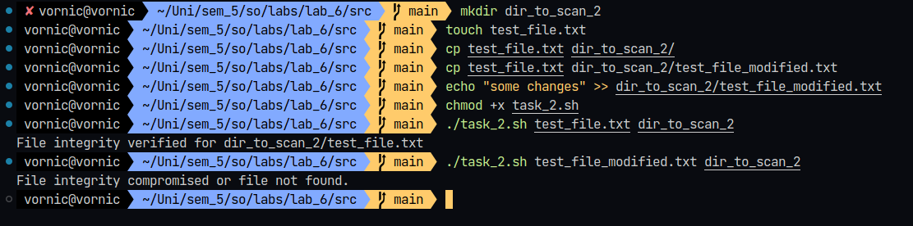
_Figure 2: Console output for Exercise 2_

### Exercise 3: Disk Space Monitor

Write a Bash script that:

1. Checks the disk usage of the system’s main partitions (/, /home, etc.) using the df command.
2. If any partition is over 80% usage, display a warning `Warning: Partition [partition_name] is above 80% usage.`
3. Write the results into a log file (`disk_usage.log`) with a timestamp for each check.

Hint:

- Use the `df -h` command to view disk usage.
- Parse the output with `awk` to extract relevant columns.
- Use the `date` command to add timestamps.

#### Implementation

The script implements disk usage monitoring using a single function that combines the `df` command with `awk` processing. The functionality is based on processing each partition's information and logging it with a current timestamp:

```bash
check_disk_usage() {
    df -h | grep -vE '^Filesystem|tmpfs|cdrom' | awk '
    {
        cmd = "date \"+%Y-%m-%d %H:%M:%S\""
        cmd | getline timestamp
        close(cmd)

        # convert usage to number explicitly
        usage = substr($5, 1, length($5)-1) + 0

        print timestamp " - Partition: " $6 ", Usage: " $5 >> "disk_usage.log"

        if (usage + 0 > 80) {
            print "Warning: Partition " $6 " is above 80% usage." > "/dev/stderr"
        }
    }'
}
```

This function converts the usage percentage to a number by extracting the substring and adding 0. It then prints the timestamp, partition name, and usage percentage to the log file. If the usage is above 80%, it prints a warning message to `stderr`.

#### Results

As shown in Figure 3, the script successfully monitored various system partitions. The output demonstrates that the script correctly identified and warned about the partitions exceeding 80% usage. The log file `disk_usage.log` contains the timestamped information about each partition's usage.

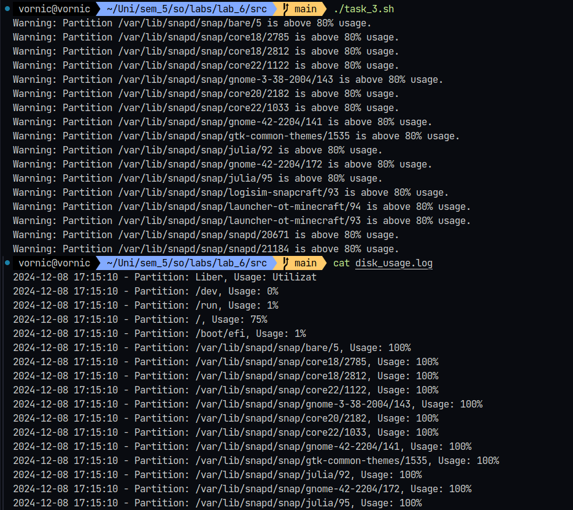
_Figure 3: Console output for Exercise 3_

### Exercise 4: System Process Tracker

Write a Bash script that:

1. Lists all currently running processes on the system, sorted by memory usage.
2. Highlights the top 5 processes consuming the most memory.
3. Saves the output into a log file (`process_log.txt`) with a timestamp.

Hint:

- Use the `ps aux` command to list processes.
- Use sort to order by memory usage.
- Use `head` to extract the top results.
- Use `date` to add timestamps to the log file.

#### Implementation

The bash script uses the `ps` command with `awk` for formatting and sorting processes by memory usage.

```bash
LOG_FILE="process_log.txt"

track_processes() {
    timestamp=$(date "+%Y-%m-%d %H:%M:%S")

    echo "Process Memory Usage Report $timestamp" > "$LOG_FILE"

    echo "----------------------------------------" >> "$LOG_FILE"
    echo "Top 5 Memory-Consuming Processes:" >> "$LOG_FILE"
    echo "----------------------------------------" >> "$LOG_FILE"

    ps aux --sort=-%mem | head -n 6 | awk 'NR>1 {
        printf "PID: %5s | User: %-10s | Memory: %5s%% | CPU: %5s%% | Command: %s\n",
        $2, $1, $4, $3, $11
    }' >> "$LOG_FILE"

    echo "----------------------------------------" >> "$LOG_FILE"
    echo "Full Process List:" >> "$LOG_FILE"
    echo "----------------------------------------" >> "$LOG_FILE"

    ps aux --sort=-%mem | awk 'NR>1 {
        printf "PID: %5s | User: %-10s | Memory: %5s%% | CPU: %5s%% | Command: %s\n",
        $2, $1, $4, $3, $11
    }' >> "$LOG_FILE"
}
```

The function `track_processes` writes the timestamp to the log file and then lists the top 5 memory-consuming processes and the full process list. It uses `ps aux --sort=-%mem` to sort processes by memory usage and `head -n 6` to extract the top 5 processes. The `awk` command formats the output for each process and appends it to the log file. The function is called at the end of the script.

#### Results

In Figure 4, the script was executed to track system processes. The output of the process log file (using `cat process_log.txt`) shows the top 5 memory-consuming processes and the full process list, sorted by memory usage. For me, Firefox and Visual Studio Code were the top memory-consuming processes.

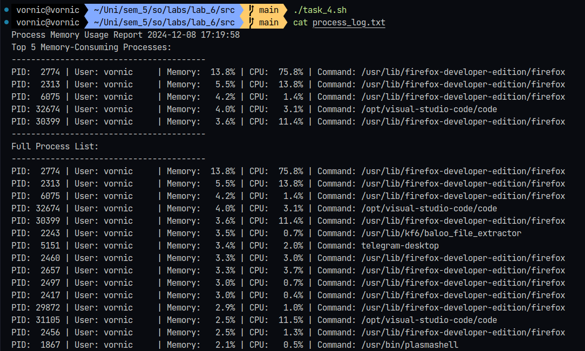
_Figure 4: Console output for Exercise 4_

### Exercise 5: Service Status Checker

Write a Bash script that:

1. Accepts a list of service names as arguments.
2. Checks if each service is running on the system.
3. For any service not running, restart it and log the action to `service_status.log`.

Hint:

- Use the `systemctl` command to check and restart services.
- Parse the output of `systemctl` status.
- Use `echo` to log actions.

#### Implementation

The script defines a function `check_and_restart_service` that takes a service name as an argument. It checks if the service exists using `systemctl list-unit-files` and if it is running using `systemctl is-active`. If the service is not running, it attempts to restart it using `systemctl restart`. As such, the function logs the status of the service and the action taken to a log file.

```bash
check_and_restart_service() {
    local service_name=$1
    local timestamp=$(date "+%Y-%m-%d %H:%M:%S")

    # if service exists
    if ! systemctl list-unit-files | grep -q "^$service_name.service"; then
        echo "$timestamp - Error: Service $service_name does not exist." >> "$LOG_FILE"
        return
    fi

    if ! systemctl is-active --quiet "$service_name"; then
        echo "$timestamp - Service $service_name is not running. Attempting to restart." >> "$LOG_FILE"

        # restart the service
        if systemctl restart "$service_name"; then
            echo "$timestamp - Successfully restarted service $service_name" >> "$LOG_FILE"
        else
            echo "$timestamp - Failed to restart service $service_name" >> "$LOG_FILE"
        fi
    else
        echo "$timestamp - Service $service_name is running normally." >> "$LOG_FILE"
    fi
}
```

The script needs at least one command-line argument and calls the function for each service name provided.

```bash
LOG_FILE="service_status.log"

if [ $# -eq 0 ]; then
    echo "Usage: $0 service1 service2 ..."
    exit 1
fi

> "$LOG_FILE"
```

#### Results

The results (as shown in Figure 5) show how the script works with the real system services of my laptop. When testing with `docker`, `rabbitmq`, `systemd-update-utmp`, and `snapd`, the script correctly identified that the first 3 services were running normally and that `snapd` was not running. It then attempted to restart the `snapd` service, which was successful.

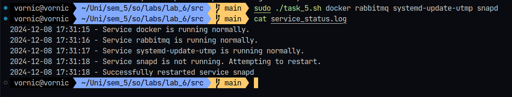
_Figure 5: Console output for Exercise 5_

The log entries show timestamps for each check and action. Each entry indicates the service status and any actions taken.

### Exercise 6: Backup Automation Script

Write a Bash script that:

1. Accepts a directory path as an argument.
2. Compresses the directory into a `.tar.gz` file with a timestamped name.
3. Moves the compressed file to a predefined backup location.

Hint:

- Use the `tar` command to create compressed archives.
- Use `mv` to relocate the archive.
- Use `basename` to extract directory names for file naming.

#### Implementation

The code for this exercise is a single function that takes a directory path as an argument. It creates a timestamped backup archive using `tar` and moves it to a predefined backup location. The function first checks if the source directory exists and then creates the backup archive. If the archive is successfully created, it moves it to the backup location.

```bash
create_backup() {
    local source_dir="$1"
    local timestamp=$(date "+%Y%m%d_%H%M%S")
    local dir_name=$(basename "$source_dir")
    local backup_file="${dir_name}_${timestamp}.tar.gz"

    if [ ! -d "$source_dir" ]; then
        echo "Directory '$source_dir' does not exist."
        exit 1
    fi

    mkdir -p "$BACKUP_DIR"

    if tar -czf "$backup_file" -C "$(dirname "$source_dir")" "$dir_name"; then
        echo "Successfully created backup archive: $backup_file"

        if mv "$backup_file" "$BACKUP_DIR/"; then
            echo "Backup moved to: $BACKUP_DIR/$backup_file"
        else
            echo "Error: Failed to move backup to destination."
            exit 1
        fi
    else
        echo "Error: Failed to create backup archive."
        exit 1
    fi
}
```

Some key features of the script include the fact that it generates unique backup filenames using timestamps, uses `basename` to handle directory paths correctly, creates compressed archives using `tar` with gzip compression, and includes error checking at each step.

#### Results

I tested the script using a directory with multiple files (Figure 6). The script created a uniquely named backup archive with timestamp (directory_name_YYYYMMDD_HHMMSS.tar.gz), compressed the directory contents, and moved the backup to the designated location. It provided clear status messages throughout the process, including when the directory did not exist.

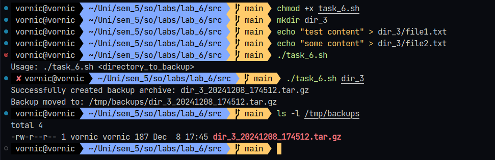
_Figure 6: Console output for Exercise 6_

### Exercise 7: Network Connectivity Checker

Write a Bash script that:

1. Pings a list of IP addresses or domain names provided in a file (`targets.txt`).
2. Logs the results of each ping (success/failure) with timestamps into `connectivity_log.txt`.
3. If any host is unreachable, display a warning message.

Hint:

- Use the `ping` command with the `-c` flag to limit the number of attempts.
- Use `while` loops to read from the file.
- Use `grep` or `awk` to parse ping results.

#### Implementation

The script centers around a main function that handles ping checks and logging:

```bash
check_connectivity() {
    local target=$1
    local timestamp=$(date "+%Y-%m-%d %H:%M:%S")

    # 2 attempts for ping
    if ping -c 2 "$target" >/dev/null 2>&1; then
        echo "$timestamp - SUCCESS: $target is reachable" >> "$LOG_FILE"
        return 0
    else
        echo "$timestamp - FAILURE: $target is unreachable" >> "$LOG_FILE"
        echo "Warning: Host $target is unreachable"
        return 1
    fi
}
```

It uses the `ping` command with the `-c` flag to limit the number of attempts to 2. The function logs the results of each ping with timestamps into `connectivity_log.txt` and displays a warning message if any host is unreachable.

The main script flow processes each line in the `targets.txt` file, calling the `check_connectivity` function for each target.

```bash
while IFS= read -r target || [ -n "$target" ]; do
    # skip empty lines and comments
    [[ -z "$target" || "$target" =~ ^[[:space:]]*# ]] && continue
    check_connectivity "$target"
done < "$INPUT_FILE"
```

#### Results

Testing was performed using a variety of targets including:

- Public DNS servers (8.8.8.8)
- Well-known domains (google.com)
- Local network addresses (192.168.1.1)
- Non-existent hosts

The script successfully pinged each target and logged the results to `connectivity_log.txt`. It displayed a warning message for unreachable hosts (Figure 7).

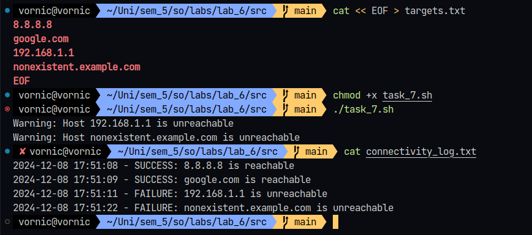
_Figure 7: Console output for Exercise 7_

### Exercise 8: Log Cleaner Script

Write a Bash script that:

1. Scans a directory for log files (`*.log`) older than 7 days.
2. Deletes these log files after prompting the user for confirmation.
3. Logs the names of deleted files into a `cleanup.log`.

Hint:

- Use the `find` command with the `-mtime` option to identify old files.
- Use `read` for user input.
- Use `echo` to log the names of deleted files.

#### Implementation

The script defines a function `cleanup_logs` that scans a directory for log files older than 7 days, prompts the user for confirmation, deletes the files, and logs the names of deleted files into `cleanup.log`.

```bash
clean_old_logs() {
    local directory=$1
    local timestamp=$(date "+%Y-%m-%d %H:%M:%S")

    if [ ! -d "$directory" ]; then
        echo "Error: Directory '$directory' does not exist."
        exit 1
    fi

    # log files older than 7 days
    old_logs=$(find "$directory" -name "*.log" -type f -mtime +7)

    if [ -z "$old_logs" ]; then
        echo "No log files older than 7 days found."
        return
    fi

    echo "The following log files will be deleted:"
    echo "$old_logs"
    read -p "Do you want to proceed with deletion? (y/n): " confirm

    if [ "$confirm" = "y" ] || [ "$confirm" = "Y" ]; then
        echo "$timestamp - Beginning cleanup operation" >> "$CLEANUP_LOG"

        while IFS= read -r file; do
            if rm "$file"; then
                echo "$timestamp - Deleted: $file" >> "$CLEANUP_LOG"
                echo "Deleted: $file"
            else
                echo "$timestamp - Failed to delete: $file" >> "$CLEANUP_LOG"
                echo "Failed to delete: $file"
            fi
        done <<< "$old_logs"

        echo "$timestamp - Cleanup operation completed" >> "$CLEANUP_LOG"
    else
        echo "Operation cancelled by user."
        echo "$timestamp - Cleanup operation cancelled by user" >> "$CLEANUP_LOG"
    fi
}
```

It uses `find` with the `-mtime` option to identify log files older than 7 days. The function then prompts the user for confirmation and deletes the files if the user agrees. A lot of `if` statements are used to handle different scenarios, such as when the directory does not exist, no old log files are found, or the user cancels the operation.

#### Results

Figure 8 shows the script in action. I create two log files with altered timestamps to simulate old log files. The script successfully identified the old log files, prompted for confirmation, and deleted the files after user approval. Using `cat cleanup.log`, I verified that the script logged the names of the deleted files.

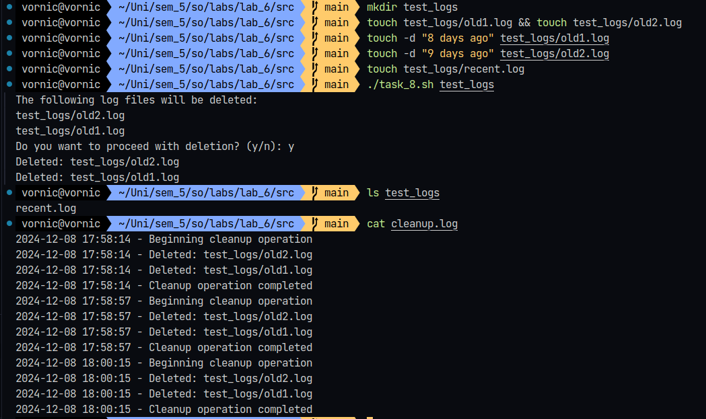
_Figure 8: Console output for Exercise 8_

### Exercise 9: Cron Job Status Monitor

Write a Bash script that:

1. Lists all active cron jobs for a specific user.
2. Checks the last execution time of each job from the system logs (`/var/log/syslog`).
3. Logs any cron jobs that failed to execute in the past 24 hours to `cron_failures.log`.

Hint:

- Use `crontab -l` to list cron jobs.
- Use `grep` with timestamps to filter recent log entries.
- Use `awk` or `cut` to extract job details.

#### Implementation

I'm using Linux Manjaro, so `journalctl` is used to access system logs. The script defines a function `monitor_cron_jobs` that lists all active cron jobs for a specific user, checks the last execution time of each job from the system logs, and logs any cron jobs that failed to execute in the past 24 hours to `cron_failures.log`.

```bash
monitor_cron_jobs() {
    local user=$1
    local timestamp=$(date "+%Y-%m-%d %H:%M:%S")

    > "$LOG_FILE"
    echo "$timestamp - Beginning cron job analysis for user: $user" >> "$LOG_FILE"

    echo "Checking cron status in logs..."
    echo "Current cron jobs for user $user:"
    crontab -l -u "$user"

    crontab -l -u "$user" | grep -v '^#' | while read -r job; do
        if [ -n "$job" ]; then
            command=$(echo "$job" | awk '{for(i=6;i<=NF;i++) printf "%s ", $i}')
            command=${command%% }

            # check exit status from journalctl
            status=$(journalctl --since "24 hours ago" -u cronie.service | grep "($user) CMD ($command)" -A 1 | grep "exit=")
            if [ -n "$status" ] && echo "$status" | grep -q "exit=[1-9]"; then
                echo "Found failed execution for job: $command"
                echo "$timestamp - Failed job: $command" >> "$LOG_FILE"
                echo "$timestamp - Status: $status" >> "$LOG_FILE"
            else
                echo "$timestamp - No failures found for job: $command" >> "$LOG_FILE"
            fi
        fi
    done

    echo "$timestamp - Cron job analysis completed" >> "$LOG_FILE"
}
```

The `$command >/dev/null 2>&1;` part of the script is used to suppress the output of the `journalctl` command. The script logs the beginning of the cron job analysis, lists the current cron jobs for the user, and then checks the status of each job in the system logs. It logs any failed jobs to `cron_failures.log`.

#### Results

As shown in Figure 9, testing was performed with two cron jobs: `/bin/false` (running every minute) and `/bin/true` (running every 5 minutes). The script successfully identified and logged the failed executions of `/bin/false`, capturing multiple instances of the failure in the log file. The log entries show proper timestamping and include both the initial job analysis timestamp and the actual execution timestamps from the cron service. The command `/bin/true` was correctly identified as executing successfully.

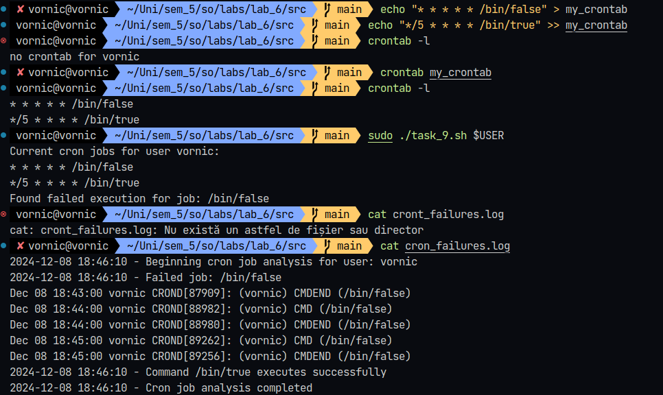
_Figure 9: Console output for Exercise 9_

### Exercise 10: RAM Usage Analyzer

Write a Bash script that:

1. Monitors the system’s RAM usage in real-time.
2. Logs the total, used, and free memory to `ram_usage.log` every minute for 10 minutes.
3. Sends an alert if memory usage exceeds 50%.

Hint:

- Use the `free -m` command to view RAM usage.
- Use sleep in a loop to run checks periodically.
- Use `mail` or `echo` for alerts.

#### Implementation

The script implements RAM monitoring through a main function that processes memory information:

```bash
monitor_ram() {
    local timestamp=$(date "+%Y-%m-%d %H:%M:%S")

    # memory info
    memory_info=$(free -m | grep "^Mem:")

    total=$(echo "$memory_info" | awk '{print $2}')
    used=$(echo "$memory_info" | awk '{print $3}')
    free=$(echo "$memory_info" | awk '{print $4}')

    usage_percent=$(( (used * 100) / total ))

    echo "$timestamp - Total: ${total}MB, Used: ${used}MB, Free: ${free}MB, Usage: ${usage_percent}%" >> "$LOG_FILE"

    if [ $usage_percent -gt $ALERT_THRESHOLD ]; then
        echo "$timestamp - ALERT: Memory usage is at ${usage_percent}% (exceeds ${ALERT_THRESHOLD}%)" >> "$LOG_FILE"
        echo "ALERT: Memory usage is at ${usage_percent}%"
    fi
}
```

The function uses `free -m` to get memory information and calculates the usage percentage. It then logs the total, used, and free memory to `ram_usage.log` and sends an alert if memory usage exceeds 50%.

The script runs the monitoring function every minute for 10 minutes.

```bash
for ((i=1; i<=TOTAL_CHECKS; i++)); do
    monitor_ram

    # don't sleep after the last check
    if [ $i -lt $TOTAL_CHECKS ]; then
        sleep $CHECK_INTERVAL
    fi
done
```

#### Results

Over 10 minutes (Figure 10), the script monitored the system's RAM usage in real-time, logging the total, used, and free memory to `ram_usage.log` every minute. It also sent an alert if memory usage exceeded 50%. As it can be seen, the memory usage was around 90% for the entire duration, triggering the alert.

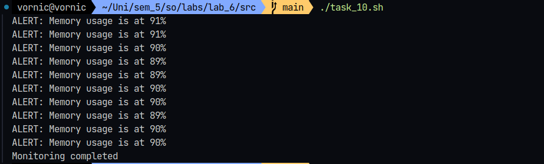
_Figure 10: Console output for Exercise 10 (alerts)_

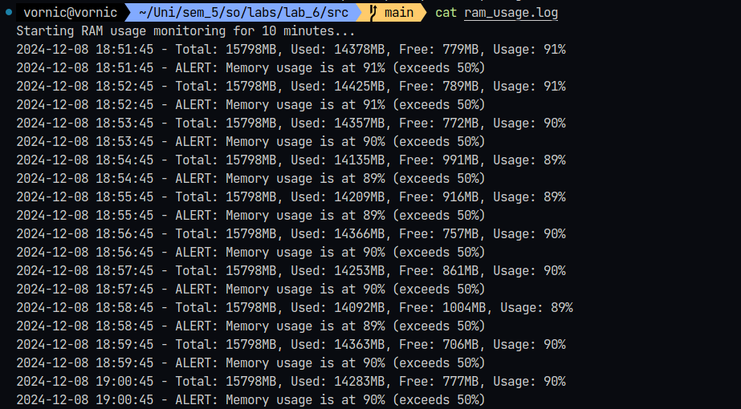
_Figure 10: Console output for Exercise 10 (logs file)_

### Exercise 11: Open Ports Scanner

Write a Bash script that:

1. Scans the system for open network ports using `netstat` or `ss`.
2. Identifies and logs which services are listening on these ports to `open_ports.log`.
3. Alerts the user if any unexpected ports (e.g., not in a predefined list) are open.

Hint:

- Use `netstat -tuln` or `ss -tuln` to list open ports.
- Use `awk` or `grep` to filter specific services.
- Use an array or file to maintain a list of allowed ports.

#### Implementation

For this exercise, `ALLOWED_PORTS` is defined as an array containing the allowed port numbers. It includes common ports like 22 (SSH), 80 (HTTP), 443 (HTTPS), 3306 (MySQL), 5432 (PostgreSQL), and 8080 (HTTP).

The script scans for open ports using `ss -tuln`, filters the output to exclude localhost, processes each line to extract the port number and protocol. It then checks if the port is allowed and logs the information to `open_ports.log`. If an unexpected port is found, it sends a warning message to the console.

```bash
ALLOWED_PORTS=(22 80 443 3306 5432 8080)

scan_ports() {
    local timestamp=$(date "+%Y-%m-%d %H:%M:%S")

    > "$LOG_FILE"
    echo "$timestamp - Beginning port scan..." >> "$LOG_FILE"

    # excluding localhost
    ss -tuln | grep LISTEN | grep -v "127.0.0.1" | while read -r line; do
        local port=$(echo "$line" | awk '{print $5}' | rev | cut -d':' -f1 | rev)
        local proto=$(echo "$line" | awk '{print $1}')

        local process=$(ss -tulnp | grep ":$port" | awk '{print $7}' | cut -d'"' -f2)

        echo "$timestamp - Found $proto port $port (Process: $process)" >> "$LOG_FILE"

        local is_allowed=false
        for allowed_port in "${ALLOWED_PORTS[@]}"; do
            if [ "$port" -eq "$allowed_port" ]; then
                is_allowed=true
                break
            fi
        done

        if [ "$is_allowed" = false ]; then
            echo "WARNING: Unexpected port $port is open ($proto - $process)" | tee -a "$LOG_FILE"
        fi
    done

    echo "$timestamp - Scan completed" >> "$LOG_FILE"
}
```

#### Results

As shown in Figure 11, running the code showed several open ports on the system. The script identified a predefined list of allowed ports (22, 80, 443, 3306, 5432, 8080) and discovered multiple unexpected open ports. The scanning process detected several services running on non-standard ports: PostgreSQL running on the allowed port 5432, instances of beam.smp service on ports 25672, 15672, and 5672 (rabbitmq), and other services like cupsd (port 631), epmd (port 4369), and kdeconnectd (port 1716).

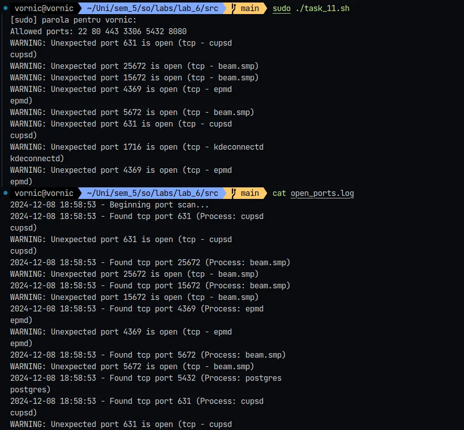
_Figure 1: Console output for Exercise 11_

The script logged each discovered port with timestamps and identified the processes. It generated warnings for all ports not in the allowed list, and the log file shows information including both the findings and warnings.

### Exercise 12: Directory Size Auditor

Write a Bash script that:

1. Analyzes the size of all subdirectories in a given directory.
2. Lists the top 5 largest directories.
3. Logs the results to `dir_size_audit.log`.

Hint:

- Use the `du -sh` command to calculate directory sizes.
- Use `sort` and `head` to find the largest directories.
- Use `basename` to clean up directory names.

#### Implementation

The `audit_directories` function takes a target directory as an argument and it checks if the directory exists. It then calculates the size of all subdirectories using `du -h --max-depth=1 */`. This command calculates the size of each subdirectory, max-depth=1 limits the depth of the search to the first level, and `*/` matches only directories.

```bash
audit_directories() {
    local target_dir="$1"
    local timestamp=$(date "+%Y-%m-%d %H:%M:%S")

    if [ ! -d "$target_dir" ]; then
        echo "Error: Directory '$target_dir' does not exist."
        exit 1
    fi

    {
        echo "$timestamp - Directory size audit for: $target_dir"
        echo "----------------------------------------"
        echo "Top 5 largest directories:"

        # store the dir sizes in a temp var
        cd "$target_dir"
        du_output=$(du -h --max-depth=1 */ 2>/dev/null | sort -hr | head -n 5)

        while IFS= read -r line; do
            size=$(echo "$line" | awk '{print $1}')
            dir=$(echo "$line" | awk '{print $2}' | xargs basename)
            echo "Size: $size  Directory: $dir"
        done <<< "$du_output"

        echo "----------------------------------------"
        echo "$timestamp - Audit completed"
    } | tee "$LOG_FILE"
}

```

It logs the timestamp and the target directory, then lists the top 5 largest directories with their sizes. It uses `basename` to clean up directory names and logs the results to `dir_size_audit.log`.

#### Results

The code implementation analyzed the directory structure of `/home/vornic/Uni`, where I store my university files. The script correctly identified and listed the top 5 largest subdirectories,excluding the parent folder. The folders which contained the most data were `sem_5`, `sem_2`, `sem_4`, `bda`, and `sem_3`, which makes sense since they contain the grouped files for each semester. (`bda` is for the database course, `sem_5` is for the 5th semester, etc.)

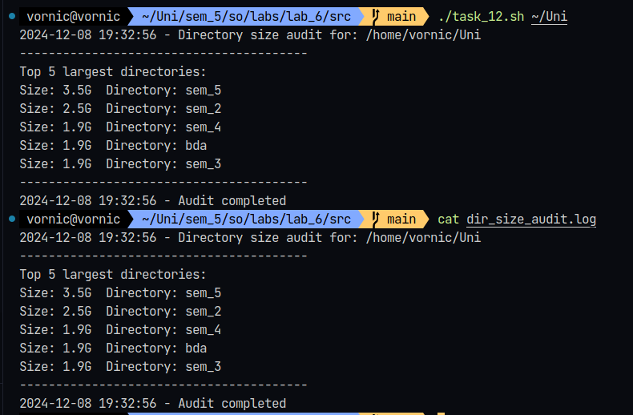
_Figure 12 Console output for Exercise 12_

The script generated identical output both in the terminal and in the `dir_size_audit.log` file.

## Conclusion

In conclusion, working on these bash scripts has given me a deeper appreciation and understanding for system administration tools. I enjoyed building the RAM usage analyzer and the port scanner, since they helped me understand my own system better. For instance, I discovered several services running on unexpected ports that I wasn't aware of. While some scripts,like the cron job monitor, required multiple attempts to get right, especially on Manjaro Linux, the debugging process taught me a lot about how different Linux distributions handle system logs and services.
