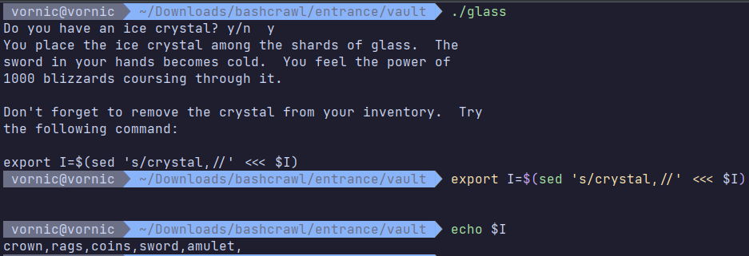
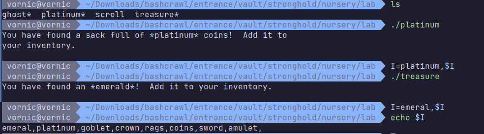

# Laboratory work #6 - Bashcrawl game

## Author: Daniela Vornic, FAF-222

## Introduction

The purpose of this laboratory work is to play a game called Bashcrawl. It is a text-based game to learn and practice Unix commands. The game is structured as a text-based dungeon crawler where players navigate through various rooms using command line operations.

## Game play

Starting in the `entrance` directory, I used `ls` to list the contents, which showed two items: a cellar directory and a scroll file. Reading the scroll with `cat` revealed basic navigation instructions, explaining the usage of `ls` to list directory contents and 'cd' for changing directories (Figure 1).

_Figure 1: Entrance_

After entering the cellar using `cd`, I executed `ls` to get three items: the armoury directory, a scroll, and a treasure file (Figure 2). The scroll's contents, introduced the concept of the `ls -F` command, which adds special indicators to differentiate between types of files. Using this command showed that armoury was a directory and treasure was an executable. The scroll also taught how to create a shell alias - I used `alias ls='ls -F'` to make this formatting permanent.

_Figure 2: Cellar_

In Figure 3, it is shown moving into the armoury, where I found four items: a chamber directory, potion and treasure executables, and a scroll. The scroll explained how to interact with executable files using relative paths.

_Figure 3: Armoury_

I went back to the cellar using `cd ..`, and executed the treasure script which contained an emerald amulet. It talked about environment variables - specifically using the I variable to store inventory items. Using the export command, I set up the inventory with export `I=amulet,$I`.

_Figure 4: Armoury treasure amulet_

Returning to the armoury (Figure 5), I executed the potion script. I used an interactive command where I chose to drink the green liquid. Setting `HP=15` with the export command gave me a baseline health value, which I confirmed by echoing the variable.

_Figure 5: Armory potion HP_

As depicted in Figure 6, I collected another piece of treasure. The program showed a silver sword and prompted me to add it to my inventory using the same export command syntax previously learned.

_Figure 6: Armoury sword_

Moving deeper into the dungeon (Figure 7), I entered the `chamber` directory which contained four items: a scroll, and three executables - spell, statue, and treasure. The scroll displayed a command for navigation - `pwd`.

_Figure 7: Armoury coins_

As evident in Figure 8, I continued collecting treasure in the chamber. Running the `./treasure` script lead to a stash of coins. Following the same pattern as before, I added the coins to my collection using export `I=coins,$I`.

_Figure 8: Armoury coins_

Figure 9 shows my first combat in the dungeon. I interacted with the statue and it came to life. Thanks to the sword in my inventory, I was able to defeat it, taking 5 points of damage. After the battle, a new executable file pieces appeared. Examining it did not give me any valuable items.

_Figure 9: Armoury statue_

Figure 10 shows a puzzle involving symbolic links in Unix. Running `./spell` revealed instructions for creating a portal using the `ln` command. The syntax `ln -fs ../../../chapel/courtyard/aviary/hall portal` created a symbolic link named "portal" pointing to a directory. Though the portal appeared in the directory listing (marked with an `@` symbol).

_Figure 10: Portal_

After going through the portal, I arrived at the library containing a scroll and a tome (as shown in Figure 11). There was a small library with shelves of books and a table with a large book. Executing `./tome` presented me with a book of spells that with Bash navigation concepts.

_Figure 11: Tome commands_

The tome, taught about Emacs mode for command-line navigation and the directory stack mechanism. It explained how to enable Emacs mode using `set -o emacs` and explained commands for cursor movement. The text then was about into directory stack management.

_Figure 12: Tome commands_

As shown in Figure 13, I began backtracking through using multiple `cd ..`, from the library through the portal, armoury, and cellar directories, until reaching the entrance. Here I discovered the unexplored `chapel` path. Inside the chapel, I found an altar executable, a courtyard directory, and a scroll. The scroll was about the command history feature - pressing the UP and DOWN arrow keys to recall previously executed commands.

_Figure 13: Chapel_

Moving in the chapel area (Figure 14), I interacted with an altar via the `./altar` command. The game presented a choice regarding a trinket found on the ground. I chose to place it back on the altar, and the game responded with atmospheric feedback.

_Figure 14: Altar_

Then in Figure 15 I enterned the courtyard, which revealed: an aviary directory, fountain and rags executables, and a scroll. The scroll included a scene of a fountain in an abandoned courtyard. Upon executing the `./rags` script, I discovered two new items - rags and a fish - which were both added to my inventory.

_Figure 15: Courtyard rags_

I explored of the courtyard's fountain and the script referenced the chapel's altar Following this hint, I returned to the altar where the interaction options had changed. This time I chose to leave the trinket on the ground, which didn't have any effect.

_Figure 16: Fountain_

Figure 17 is me going into the aviary section. After navigating through the courtyard, I entered a new folder containing a crystal and penguin executable, a hall directory, and an informative scroll. The scroll described a room with penguins and wrote about the Tab key autocomplete functionality.

_Figure 17: Aviary_

I interacted with the penguin executable, which needed the fish item from my inventory.

_Figure 18: Penguin_

Then I collected the crystal from the aviary, which was added to my inventory.

_Figure 19: Crystal_

Next, I decided to finally fight the monster. The combat seemed to be based on number comparisons. Over three rounds of combat, my character took 5 points of damage when my roll of 38 failed against the monster's 73. Finally, I rolled 32 against the monster's 20, which resulted in victory.

_Figure 20: Monster_

After defeating the monster, the monster executable was replaced with carcass and treasure files. The carcass did not do anything, but executing the treasure script revealed a crown. I added this new item to my inventory.

_Figure 21: Crown_

I went back 2 directories and executed the penguin file again. Having already used my fish previously, I faced the penguin without the proper item. The penguins trapped me in ice for 128 years.

_Figure 22: Penguin attack_

Not knowing what to do next, I explored the current directory contents and went up to the entrance. Here I discovered the vault, I entered it, and in the `scroll` there were descriptions of watching glass shards and two contrasting goblets.

_Figure 23: Vault_

Executing the `./glass` initiated a check for the ice crystal. Using the crystal introduced another `sed` command to modify our inventory. I had to remove the crystal from the inventory.

_Figure 24: Glass_

From the vault I went into the stronghold (Figure 25). Inside, I found a scroll describing a puzzle involving a goblet and three orbs, though only one (`orb1`) remained. The scroll hinted at copying objects, introducing the Unix cp command. I used the `cp` command to create copies of `orb1`, naming them `orb2` and `orb3`.

_Figure 25: Stronghold_

Running the `./goblet` script materialized the item, which I then added to my inventory (Figure 26).

_Figure 26: Goblet_

I opened the nursery. Executing the spell script introduced a new Unix command - `find`. The script taught that `find . -name "potion"` can search for files, and suggested searching from the entrance directory for a potion file.

_Figure 27: Nursery_

Looking at Figure 29, I tried out the new find command to search for a potion, but did not find anything. I checked out the scroll file, and things got interesting when I ran into a the ghost, which later turned out to be the evil wizard. I was able to defeat it.

_Figure 28: Ghost_

After that, in the directory there appeared the executable files treasure and platinum. I added platinum and emerald to my inventory.

_Figure 29: Wizard treasure_

I still wanted to use the `find` command for the potion, and drank it, gaining 15 health points. Before I had 10.

_Figure 30: Potion 2_

I was walking through the rooms, and decided to go back to the entrance. Here I found a new scrap file. The note provided a command to create a symbolic link to a hidden directory.

_Figure 31: Scrap_

In Figure 32, I was reminded of the flams so the portal creation command needed to be executed from the lab location. I entered the rift.

_Figure 32: Rift_

Interacting with the box there, I entered "dana" as the username, but nothing happened. Then, moving into the arena revealed an location - the Chamber of Nyarlathotep. The scroll depicts an arena, and its text warns of an upcoming challenge.

_Figure 33: Box_

Figure 35 show my final encounter in the game. In the pit, I faced Nyarlathotep with several interactive elements: a drum, drummer, and wizard-light. Following the drummer's hint, I used the Unix `rm` command to remove the war drums. Despite my sword and previous combat experience, my rolls were no match.

_Figure 34: Nyarlathote_

Nonethless, after my defeat, I used the find command to locate my character's corpse in the `.rift` directory. Reading the file showed all the items I had collected before. After putting them in my current inventory, I backtracked through the rift and checked outthe spire.

_Figure 35: Corpse_

I went into the `mezzanine` level of the spire. The location contained an elevator mechanism - pressing a button revealed a door, and inside, a display showing the number 666.

_Figure 36: Mezzanine_

In the elevator, I opened a door. It contained several files. The notebook, written by "Thraal, Artificer of the Kingdom of Nor," opens with instructions for creating a robot by combining four parts (alpha, beta, gamma, delta) in a specific order.

_Figure 37: Robot notebook_

I tried different combinations to assembly the robot using the combination "delta beta alpha gamma", confirmed by the `sha256sum` check. Following the instructions, I made the robot executable. However, it went badly and I lost again.

_Figure 38: Robot over_

I went back to get my corpse, went into the arena pit this time, but got stuck trying to defeat the Nyarlathote.

_Figure 39: Nyarlathote end_

## Conclusion

Playing Bashcrawl was entertaining, educational and a bit frustrating. I practiced many commands and I thought the plot was interesting. The game was well-designed and challenging, with a good mix of puzzles and combat. I enjoyed the experience and would recommend it to anyone looking to improve their Unix skills. Hopefully, another time I would be able to defeat Nyarlathote.
